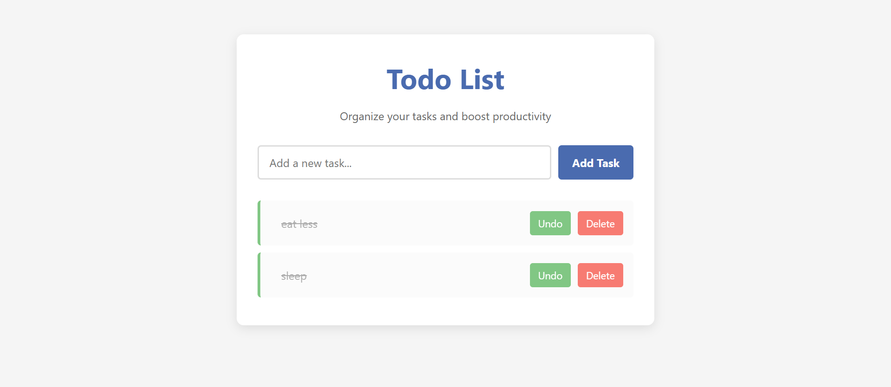
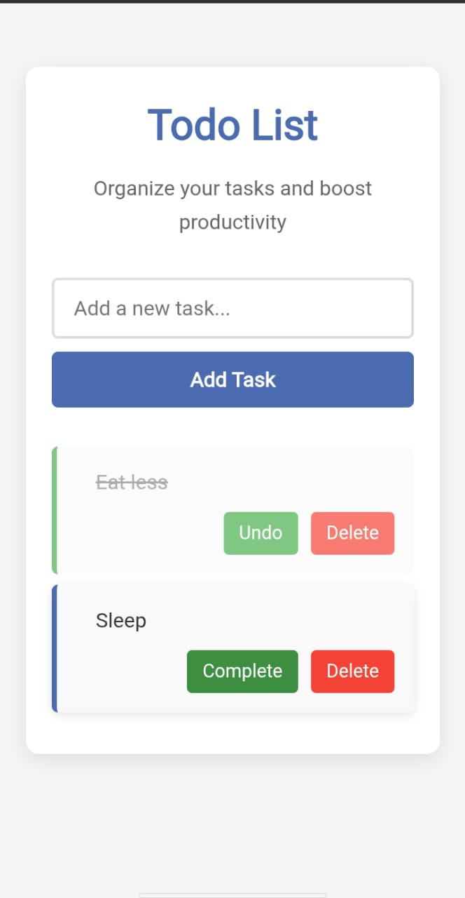

# ✅ Awesome Todo List WEB App 🚀

> Organize your tasks & stay productive with this sleek, responsive and localStorage-powered Todo App!  
> Built with ❤️ using HTML, CSS & JavaScript (no frameworks!).

## 🌟 Features

- 🖊️ Add New Tasks
- ✅ Mark Tasks as Complete / Undo
- 🗑️ Delete Tasks
- 💾 Save Tasks using localStorage
- 📱 Fully Responsive Layout
- 🎨 Modern UI Design with Transitions & Animations
- 😍 Beautiful Empty State SVG Message

---

## 🔗 Live Preview

👉 [View Live App(https://ammarmarediya.github.io/To-Do-List-Web-App/)  
🔗 [GitHub Repo](https://github.com/AmmarMarediya/To-Do-List-Web-App.git)

---

## 📸 Screenshots

| 💻 Desktop View | 📱 Mobile View |
|----------------|----------------|
|  |  |

---

## 🛠️ Built With

- HTML5  
- CSS3 (Flexbox, Animations, Transitions)  
- Vanilla JavaScript  
- localStorage API  

---

